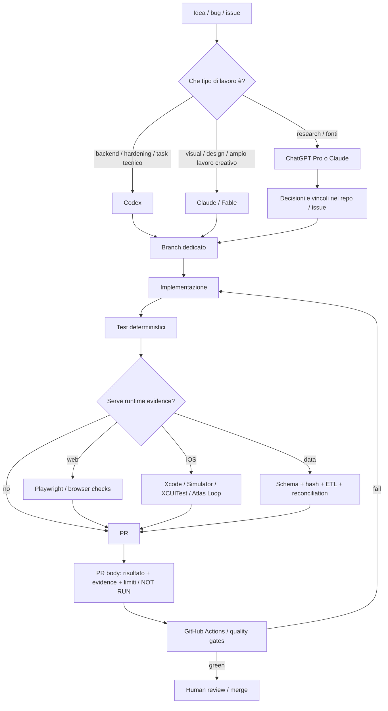

# Developer AI Workflow Profile v1 — Francesco Giannicola

**Data:** 2026-09-06  
**Scopo:** ricostruire non solo *cosa produce*, ma **con quali strumenti e con quale processo operativo**.  
**Formato:** questo documento usa uno schema pensato per essere replicato identico su altri sviluppatori e quindi confrontabile.

> Regola metodologica: un commit di un collaboratore, una feature supportata da un suo prodotto o una tecnologia presente nel repository **non dimostrano automaticamente che Francesco la usi ogni giorno**. Tutto è separato fra evidenza diretta, inferenza forte e non dimostrato.

---

## 0. Legenda della confidenza

| Livello | Significato |
|---|---|
| **CONFERMATO** | Francesco lo dichiara direttamente, oppure l'evidenza pubblica lo attribuisce direttamente a lui/sessioni/branch personali. |
| **FORTE** | Più evidenze indipendenti e coerenti rendono molto probabile il comportamento, ma manca una dichiarazione esplicita del tipo “questo è il mio workflow quotidiano”. |
| **POSSIBILE** | È nell'ecosistema/progetto, ma non possiamo attribuirne l'uso personale. |
| **NON OSSERVATO** | Ho cercato evidenze pubbliche ma non ne ho trovate abbastanza. Non significa che non lo usi. |

---

# 1. Profilo sintetico

| Dimensione | Ricostruzione | Confidenza |
|---|---|---|
| Harness principale di coding | **Codex + Claude Code** | **CONFERMATO** |
| Modelli/ruoli | Codex/GPT per backend, implementazione e hardening; Anthropic Fable/Opus molto presente, con preferenza esplicita per Fable sul design | **CONFERMATO** |
| Ricerca non-coding | ChatGPT Pro per ricerche lunghe; Claude Code anche per lavori data/research dentro la repo | **CONFERMATO** |
| Source of truth | Git/GitHub, issue, branch, PR, CI, artefatti nel repository | **FORTE** |
| Stile di lavoro | task/feature piccola → branch/PR → test/evidence → review/merge | **FORTE** |
| Spec | spec/documento prima del codice **quando la modifica è multi-componente o semantica**, non spec pesante per tutto | **CONFERMATO** |
| Skill | skill custom per processi specialistici; non un catalogo enorme obbligatorio per ogni lavoro | **CONFERMATO** |
| Verification | test deterministici + runtime evidence + CI fail-closed; distingue sempre ciò che è provato da ciò che non è stato eseguito | **CONFERMATO** |
| Multi-agent | costruisce sistemi multi-agent e usa più harness; non c'è prova che un orchestratore multi-agent proprietario sia il suo workflow quotidiano universale | **POSSIBILE / FORTE sul multi-harness** |
| Human-in-the-loop | il giudizio umano resta importante nei lavori lunghi; approvazioni esplicite nei flussi visuali | **CONFERMATO** |
| Framework tipo GSD/OpenSpec/Spec Kit/Trailhead | nessuna evidenza pubblica sufficiente trovata | **NON OSSERVATO** |

---

# 2. Il diagramma più probabile della sua workstation



La parte da notare non è “usa Codex”. È questa:

> **l'agente non è la fonte della verità. Il repository e le prove osservabili lo sono.**

---

# 3. Tool matrix — cosa usa davvero

Questa è la tabella che dovremo riusare, identica, per ogni sviluppatore analizzato.

| Layer | Tool / pratica | Evidenza pubblica | Confidenza | Ruolo ricostruito | Da replicare? |
|---|---|---|---|---|---|
| Coding harness | **OpenAI Codex** | Decine di branch personali `metaforismo/codex/...` in Atlas Loop e Bite; Devpost Museion/IntentForm dichiarano Codex | **CONFERMATO** | Implementazione, backend, hardening, PR-sized work | **SÌ** |
| Coding harness | **Claude Code** | PR DVNS con `Claude-Session:` e `Generated with Claude Code`; commit personali co-authored Claude | **CONFERMATO** | Lavori complessi/lunghi, data/research, implementazione | **SÌ** |
| Model | **GPT-5.6 Sol** | Post pubblico: “Built with Codex + GPT-5.6 Sol Low”; Devpost Museion | **CONFERMATO** | Coding / prototipi UI / Build Week | SÌ, modello intercambiabile |
| Model | **Claude Fable 5** | Dichiarazione pubblica: paga Anthropic perché “Codex is good on backend… Fable is amazing” sul design; molti commit personali co-authored Fable | **CONFERMATO** | Design, UI, visual polish; anche implementazione | **SÌ se utile** |
| Model | **Claude Opus 5 / 1M** | PR DVNS complesse con co-author e sessioni Claude Opus 5 | **CONFERMATO** | Data engineering, ricerca dentro codebase, task lunghi | SÌ, come modello high-complexity |
| Research | **ChatGPT Pro** | Post LinkedIn: ricerca di 46 minuti sulla spesa pubblica italiana con ChatGPT 5.5 Pro | **CONFERMATO** | Ricerca larga, fonti, analisi prima/durante prodotto | **SÌ** |
| Version control | **Git + GitHub** | Presenza sistematica di issue/PR/branch, contributi upstream, GitHub Actions | **CONFERMATO** | Stato durevole e review surface | **SÌ** |
| Work tracking | **GitHub Issues / PR** | DVNS >200 PR in poche settimane; PR personali codex/*; issue collegate ai commit | **FORTE** | Task shaping, review, history | **SÌ** |
| CI | **GitHub Actions** | Skill dichiarata sul sito; repo con workflow e test gate | **CONFERMATO** | Arbitro deterministico dopo l'agente | **SÌ** |
| Web runtime verify | **Playwright** | Skill dichiarata sul sito; Museion/IntentForm Built With; repo con browser gates | **CONFERMATO** | Verifica interfaccia reale | **SÌ** |
| Unit/integration test | **Vitest / test repo-specific** | Devpost Museion; Cumea ha suite contract/harness; DVNS suite Node/ETL/snapshot | **CONFERMATO** | Contratti e regressioni | **SÌ** |
| Native dev | **Xcode / SwiftUI** | Bite, Atlas Loop, IntentForm; App Icon Studio; sito personale | **CONFERMATO** | iOS/native app development | se pertinente |
| Native runtime verify | **Simulator / XCUITest** | Atlas Loop guida Simulator e XCUITest con evidence | **CONFERMATO** | Prova reale dei flussi iOS | se pertinente |
| Evidence tooling | **Atlas Loop** | Progetto personale costruito esattamente per screenshot/log/network/state/video/metrics evidence | **CONFERMATO come tool costruito; FORTE come filosofia operativa** | Rendere verificabile l'output degli agenti | **Principio SÌ** |
| Agent control | **AgentKeys** | Progetto personale con integrazione Codex app-server e Claude Agent SDK | **CONFERMATO** | Lifecycle/approvals/session control | principio utile, non necessario per Stealth |
| Multi-agent harness | **Cumea** | Progetto personale con Claude/Codex/Grok/Gemini driver, handoff, approval e task history | **CONFERMATO come progetto** | Esperimento/control surface multi-agent | **NO finché non prova valore** |
| Protocol/tools | **MCP** | Atlas Loop espone capacità via MCP; Cumea monta MCP; DVNS ha MCP pubblico | **CONFERMATO** | Dare tool tipizzati agli agenti e mantenere parità CLI/tool | **SÌ dove utile** |
| Image generation | **OpenAI Imagegen** | Museion/IntentForm Devpost; app-icon-design-skill usa built-in Imagegen | **CONFERMATO** | Concept visuali | opzionale |
| Design production | **Apple Icon Composer** | app-icon-design-skill lo rende gate di produzione dopo approvazione visuale | **CONFERMATO** | Produzione icone native | non pertinente a Stealth |
| Data verification | **hash, snapshot, schema, reconciliation, fail-closed ETL** | Numerose PR DVNS descrivono hash, source lock, check offline e riconciliazioni | **CONFERMATO** | Trasformare assunzioni in contratti eseguibili | **SÌ come principio** |
| Deploy | **Vercel / Cloudflare** | Devpost e portfolio; Bite usa Cloudflare Worker | **CONFERMATO per progetti specifici** | Hosting/runtime | secondo progetto |
| Video/content | **Remotion** | Museion Devpost Built With | **CONFERMATO per Museion** | contenuti/video programmatici | no, salvo necessità |
| Editor | VS Code / Cursor / altro | Nessuna evidenza personale sufficiente | **NON OSSERVATO** | — | irrilevante finché harness lavora bene |
| Cursor agent | Cursor | Molti commit DVNS sono co-authored da Cursor, **ma quelli verificati sono di Dom**, non di Francesco | **POSSIBILE nel team, NON PROVATO personale** | Contributor tooling | **NON assumere** |
| GitHub Copilot | Copilot App | Compare in DVNS su contributi del team | **POSSIBILE nel progetto, NON PROVATO personale** | Contributor agent | non necessario |
| GSD | GSD | Nessuna evidenza trovata | **NON OSSERVATO** | — | studiarlo indipendentemente |
| OpenSpec / Spec Kit | OpenSpec / Spec Kit | Nessuna evidenza trovata | **NON OSSERVATO** | — | non attribuirglieli |
| Trailhead | Trailhead | Nessuna evidenza trovata | **NON OSSERVATO** | — | non attribuirglielo |
| Superpowers | Superpowers | Nessuna evidenza trovata | **NON OSSERVATO** | — | non attribuirglielo |

---

# 4. La scoperta più importante: non usa un singolo “miglior agente”

C'è un'evidenza pubblica molto precisa sulla divisione dei ruoli.

In una risposta pubblica Francesco scrive, in sostanza, che **paga per i modelli Anthropic perché Codex è bravo nel backend e nel “fare cose”, mentre Fable è molto migliore sul design**.

Fonte pubblica indicizzata:  
https://zamantika.com/LexnLin/status/2093374968570487048

Questo spiega parecchi segnali che altrimenti sembravano contraddittori:

- repository personali pieni di branch `codex/...`;
- moltissimi commit co-authored da Claude Fable;
- PR DVNS complesse svolte tramite sessioni Claude Code/Opus;
- demo visuali pubbliche create anche con Codex + Sol.

La lettura più credibile è quindi:

```text
NON
"ha trovato l'agente perfetto"

MA
"sceglie harness/modello in base al tipo di lavoro"
```

Per Stealth questa è una lezione più utile dell'installare cinque orchestratori.

---

# 5. Evidenza forte di Codex come vero worker, non semplice autocomplete

Su `metaforismo/atlas-loop` compaiono merge di PR da branch come:

```text
metaforismo/codex/large-session-performance
metaforismo/codex/run-scrubber
metaforismo/codex/network-capture
metaforismo/codex/session-state-diff
metaforismo/codex/mcp-cli-parity
metaforismo/codex/first-run-errors
...
```

Su `metaforismo/Bite`:

```text
metaforismo/codex/performance-hardening
metaforismo/codex/privacy-archive-deletion
metaforismo/codex/release-observability-gates
metaforismo/codex/integrate-secure-health-files
metaforismo/codex/product-truth-hardening
...
```

Questo è importante perché il pattern è **branch/PR-sized autonomous work**, non “chiedo a Copilot di completare tre righe”.

Esempio pubblico ulteriore: il 12 luglio pubblica una UI dicendo esplicitamente:

> Built with Codex + GPT-5.6 Sol Low.

Fonte indicizzata:  
https://note.com/kawakijourney_ai/n/nb56a79ec3e0e?hl=en

---

# 6. Evidenza forte di Claude Code come worker parallelo/alternativo

DVNS contiene PR particolarmente istruttive perché il corpo della PR rende visibile la sessione e ciò che è stato verificato.

Esempi:

- Eurostat COFOG;
- ISTAT COFOG;
- INPS NASpI;
- ISTAT povertà assoluta/relativa.

I corpi riportano elementi come:

```text
Claude-Session: https://claude.ai/code/session_...
Generated with Claude Code
Co-Authored-By: Claude Opus 5
```

e poi una lista separata di prove reali:

```text
npm run ci:static
npm run test:node
npm run test:etl
npm run test:snapshots
npm run build
git diff --check
```

oltre a **limiti/prove non eseguite**.

Questa è una delle differenze fondamentali rispetto a un workflow agentico fragile:

> l'agente può aver scritto quasi tutto, ma il claim di completamento è legato a evidence indipendente.

---

# 7. Come trasforma una procedura ripetitiva in una skill

L'esempio più pulito è `metaforismo/app-icon-design-skill`.

Non è una “skill da prompt” vaga. Definisce un processo preciso:

```text
brief
→ collision scan
→ 1–2 direzioni complete
→ revisioni con una sola variabile
→ approvazione visuale ESPLICITA
→ gate di fattibilità
→ SVG/PNG deliberati
→ Apple Icon Composer
→ Xcode + small-size + context validation
```

La skill include anche uno script Python deterministico `icon_qa.py`.

Quindi il modello riutilizzabile che emerge è:

```text
quando un processo specialistico ricorre:

ISTRUZIONI
+ GATE UMANI dove il giudizio è estetico/semantico
+ SCRIPT deterministici dove la macchina può provare il risultato
```

Non ho trovato prova che trasformi **ogni** procedura in skill. Sembra farlo dove esiste realmente un workflow riutilizzabile.

Fonte:  
https://github.com/metaforismo/app-icon-design-skill

---

# 8. Come verifica l'interfaccia: evidence, non “sembra giusta”

Atlas Loop è forse il pezzo più utile da studiare per il tuo problema specifico.

È costruito per consentire a un agente di operare su un iOS Simulator e lasciare evidence locale ispezionabile:

- screenshots;
- risultato di ogni azione;
- video;
- logs;
- diff dello stato applicativo;
- network requests;
- trace;
- CPU/memory metrics;
- mappa degli screen/transition realmente osservati;
- visual-regression baseline;
- issue draft generabile dal fallimento.

Espone le stesse capacità via CLI e MCP.

La lezione non è “installiamo Atlas Loop” — è iOS-specifico.

La lezione è:

```text
un agente che modifica una UI
non deve dire
"ho controllato, è bella"

deve poter produrre
artefatti osservabili del runtime
```

Fonte:  
https://github.com/metaforismo/atlas-loop

Questo è direttamente applicabile al problema che hai avuto anche con la homepage Stealth: **la validazione visuale deve diventare parte del sistema, non un favore che chiedi al modello alla fine**.

---

# 9. Spec-driven, ma proporzionale

Bite dichiara una regola concreta:

> una modifica che tocca più componenti parte prima da una spec in `docs/specs/`.

Non vedo invece la prova di un framework SDD universale come OpenSpec o Spec Kit.

Quindi il pattern sembra essere:

```text
micro change
→ implementa + verifica

multi-component / semantico
→ spec nel repository
→ implementa
→ verifier / preflight
```

Fonte:  
https://github.com/metaforismo/Bite

Questa è molto più vicina alla proporzionalità che avevamo immaginato per ADS rispetto a “spec obbligatoria sempre”.

---

# 10. Human-in-the-loop: non sembra puntare all'autonomia cieca

In un commento pubblico sullo scaling dei coding agent Francesco scrive:

> “They are great at fast starts, but long work still needs taste, memory, and many small human decisions.”

Fonte indicizzata:  
https://digg.com/tech/3ao71e2l

È coerente con i suoi tool:

- approvazioni visuali esplicite nelle skill;
- permission/approval states in AgentKeys/Cumea;
- PR come review surface;
- runtime evidence prima del claim;
- “NOT RUN” espliciti invece di pretendere una copertura inesistente.

Quindi il suo sistema non sembra voler eliminare l'umano.

Vuole **spostare l'umano sui punti dove il suo giudizio vale davvero**.

---

# 11. Ricostruzione del ciclo quotidiano più probabile

> Questa sezione è **inferenza forte**, non una registrazione del suo desktop.

### A. Idea / problema

Parte da:

- issue;
- bug osservato;
- feature;
- ricerca/paper/prodotto da reverse-engineerizzare.

### B. Decide il worker

```text
backend / correctness / hardening
→ Codex

visual / design / interaction
→ Claude Fable

large research/data task nel repo
→ Claude Code / Opus

broad research fuori dal repo
→ ChatGPT Pro
```

### C. Scrive lo stato importante fuori dalla chat

Quando serve, la decisione finisce in:

- issue;
- spec;
- README/playbook;
- contratto/schema;
- test;
- repository artifact.

Quindi la sessione AI può morire senza portarsi via il progetto.

### D. Worker su branch

Il lavoro procede in branch/PR isolabili e rivedibili.

### E. Ogni assunzione importante diventa macchina quando possibile

Esempi reali:

```text
"questa fonte è quella giusta"
→ URL + hash + source lock

"queste grandezze si riconciliano"
→ assertion / test

"la UI funziona"
→ browser/Simulator evidence

"il deploy è riproducibile"
→ preflight

"questa interfaccia ha la capability"
→ parity/contract tests
```

### F. PR come report di lavoro

Una buona PR dice:

1. cosa cambia;
2. perché;
3. quali rischi/semantiche sono stati osservati;
4. cosa è stato verificato;
5. cosa **non** è stato verificato;
6. follow-up fuori scope.

### G. CI / review

La sessione dell'agente non chiude il discorso. I gate esterni possono riportare il lavoro indietro.

---

# 12. Cosa NON sono riuscito a dimostrare

Questa sezione è parte obbligatoria del profilo comparabile.

### Editor esatto

Non ho trovato evidenza affidabile del suo editor quotidiano attuale.

- Cursor compare molto in DVNS, ma commit verificati sono attribuiti al co-founder Dom.
- non sarebbe corretto concludere “Francesco usa Cursor”.

### Terminale esatto

Cumea contiene prove di ambiente macOS, Homebrew/nvm e CLI `claude`/`codex`, ma non ho una registrazione della sua shell/workstation quotidiana.

### GSD / OpenSpec / Spec Kit / Trailhead / Superpowers

Non ho trovato una firma pubblica che dimostri il loro uso.

### Orchestratore segreto

Non ho trovato alcun repository/config/session evidence che giustifichi l'ipotesi:

> “tutte le sue repo vengono create automaticamente da un framework privato”.

È ancora possibile che abbia script/config private, ma **non serve ipotizzarli per spiegare ciò che vediamo**.

### Grok / Gemini come daily driver

Cumea li supporta e li testa. Questo prova competenza e integrazione, non uso quotidiano principale.

### YouTube / talk workstation walkthrough

Ho identificato il canale YouTube collegato direttamente dal suo portfolio:

https://www.youtube.com/channel/UCYaWvTE2XvKI2u-9mqJysdw

I motori che ho interrogato non indicizzano al momento contenuti/workstation walkthrough sufficienti da permettermi di attribuire strumenti aggiuntivi con rigore. **Non li considero quindi evidence.**

---

# 13. Fonti pubbliche analizzate per questo profilo

## Identità / portfolio

- https://francescogiannicola.com/
- https://francescogiannicola.dev/
- https://it.linkedin.com/in/francescogiannicola/it
- https://github.com/metaforismo

## Repository personali rappresentativi

- https://github.com/metaforismo/atlas-loop
- https://github.com/metaforismo/Cumea
- https://github.com/metaforismo/Bite
- https://github.com/metaforismo/AgentKeys
- https://github.com/metaforismo/IntentForm
- https://github.com/metaforismo/app-icon-design-skill

## DVNS

- https://github.com/Italian-Builders-Org/DoveVannoINostriSoldi
- PR recenti con session/evidence Claude, source contracts e verifier

## Build Week / tool declarations

- https://devpost.com/software/museion
- https://devpost.com/software/intentform

## Social / dichiarazioni

- Post Codex + GPT-5.6 Sol Low indicizzato qui: https://note.com/kawakijourney_ai/n/nb56a79ec3e0e?hl=en
- Codex backend vs Fable design: https://zamantika.com/LexnLin/status/2093374968570487048
- human judgment nei long-running agent task: https://digg.com/tech/3ao71e2l
- LinkedIn: ricerca pubblica con ChatGPT Pro e build-in-public

## Video

- Canale ufficiale linkato dal portfolio: https://www.youtube.com/channel/UCYaWvTE2XvKI2u-9mqJysdw
- nessun walkthrough sufficientemente indicizzato trovato in questa ricognizione

---

# 14. Minimum Viable Francesco Method — cosa replicherei senza copiarne lo stack

Se volessimo ottenere **l'effetto** senza trasformare Stealth in un laboratorio di tooling, partirei da sette cose:

```text
1. GitHub come memoria del lavoro
2. Codex come worker principale
3. Claude Code come secondo worker con ruolo diverso, non duplicato
4. spec solo quando il cambiamento la merita
5. skill solo per workflow specialistici ricorrenti
6. verifier/runtime evidence realmente osservabili
7. PR + CI che possono smentire l'agente
```

Non partirei da:

```text
Cumea
+ AgentKeys
+ GSD
+ Trailhead
+ OpenSpec
+ altri tre orchestratori
```

Il pattern che emerge da Francesco è quasi l'opposto: **costruire o introdurre infrastruttura quando serve a rendere verificabile un problema concreto**.

---

# 15. STANDARD COMPARABILE — Developer AI Workflow Profile v1

Da qui in avanti, per ogni sviluppatore che vuoi studiare, useremo sempre queste stesse dimensioni.

## A. Identity & corpus

- persona/profilo;
- repository campione;
- periodo osservato;
- social/talk/video analizzati;
- quantità/qualità delle evidenze.

## B. Primary harnesses

| Harness | Evidence | Confidence | Role |
|---|---|---|---|
| ... | ... | ... | ... |

## C. Model strategy

| Model | Quando lo usa | Evidence | Confidence |
|---|---|---|---|
| ... | ... | ... | ... |

## D. Work intake / source of truth

- issue tracker;
- TODO/spec locali;
- chat;
- project management;
- auto-created issue sì/no.

## E. Planning / specification

- nessuna / light / full SDD;
- strumenti specifici;
- quando scatta;
- acceptance criteria;
- design document.

## F. Repo memory

- `AGENTS.md`;
- `CLAUDE.md`;
- rules;
- docs;
- architecture map;
- decision log;
- generated knowledge.

## G. Skills / plugins / MCP

| Tool | Globale o repo-local | Auto o manuale | Ruolo | Evidence |
|---|---|---|---|---|
| ... | ... | ... | ... | ... |

## H. Code intelligence

- native harness search;
- Serena/code graph/indexer;
- LSP;
- custom maps;
- retrieval strategy.

## I. Execution model

- direct edits;
- branch;
- worktree;
- subagents;
- Ralph loops;
- cloud agents;
- parallelism;
- session handoff.

## J. Verification

| Layer | Metodo | Deterministico? | Evidence persistita? |
|---|---|---|---|
| syntax | ... | ... | ... |
| unit/integration | ... | ... | ... |
| browser/UI | ... | ... | ... |
| runtime | ... | ... | ... |
| security | ... | ... | ... |
| semantic AC | ... | ... | ... |

## K. Runtime evidence

- screenshots;
- browser traces;
- console/network;
- videos;
- DB evidence;
- diff stato;
- device/simulator;
- logs;
- performance.

## L. Review & quality gates

- self-review;
- independent model review;
- human review;
- CodeQL/security;
- branch protections;
- CI required.

## M. Release / deploy

- PR;
- preview env;
- staging;
- deploy automation;
- smoke test;
- rollback;
- human gate.

## N. Human role

- quali decisioni mantiene l'umano;
- quali delega;
- quando interrompe l'agente;
- quali approval gate sono espliciti.

## O. Daily workflow reconstruction

Un diagramma unico dal prompt alla produzione.

## P. Tool evidence matrix

Sempre con queste colonne:

```text
Layer
Tool/pratica
Evidence
Confidence
Role
Replicate?
```

## Q. Unknowns / negative evidence

Cosa abbiamo cercato ma **non possiamo affermare**.

## R. Replication recipe

- cosa copiare;
- cosa non copiare;
- costo/configurazione;
- versione minima del metodo.

---

# 16. Scorecard per confrontare sviluppatori

Userei una scala 0–5 sulle stesse dimensioni:

| Dimensione | Francesco — valutazione provvisoria |
|---|---:|
| Repo come memoria | **5** |
| Specifiche proporzionali | **4** |
| Specializzazione dei modelli | **5** |
| Agent autonomy | **4** |
| Human judgment / taste gates | **5** |
| Deterministic verification | **5** |
| Runtime evidence | **5** |
| CI / fail-closed | **5** |
| Multi-agent sophistication | **4** |
| Issue/PR traceability | **5** |
| Tooling portability | **4** |
| Cerimonia / overhead | **3–4** a seconda della repo |

> Questi non sono voti di “bravura”. Servono per confrontare **il metodo operativo** fra profili diversi.

---

# 17. Conclusione aggiornata

La risposta più concreta alla domanda “**come fa a produrre repository così senza scrivere tutto a mano?**” è ora questa:

```text
usa davvero agenti che fanno porzioni grandi del lavoro
        ↓
principalmente Codex e Claude Code
        ↓
ma non chiede alla sessione di ricordare o dimostrare tutto
        ↓
sposta conoscenza, vincoli e stato nel repository/GitHub
        ↓
trasforma le assunzioni importanti in test/contratti/verifier
        ↓
controlla il runtime con evidence quando il codice da solo non basta
        ↓
la PR racconta esattamente cosa è provato e cosa no
        ↓
CI + umano decidono se il lavoro è davvero finito
```

Quindi non è corretto dire “fa tutto a mano”, ma neppure “ha un framework segreto che fa tutto”.

Il vantaggio sembra venire da una combinazione molto più replicabile:

> **alta delega del codice + alta disciplina dell'evidence.**
