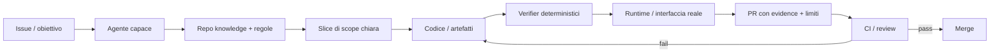
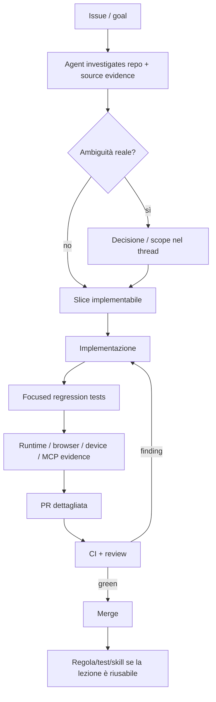
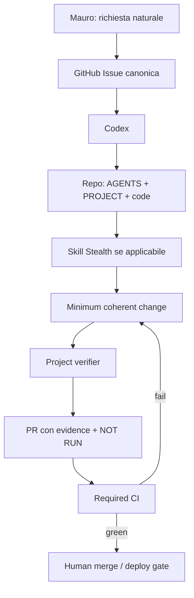

# Reverse engineering — il metodo pubblico di Francesco Giannicola

> Ricerca svolta il 6 settembre 2026.  
> Perimetro: **solo evidenze pubbliche** — repository, commit, PR, documentazione e sito personale.  
> Obiettivo: capire *come sembra lavorare con gli agenti*, cosa è trasferibile a Stealth e cosa invece è specifico dei suoi progetti.

## Executive summary

La conclusione più importante è negativa:

**non emerge un “framework segreto” unico che spiega la qualità del lavoro.**

Emerge invece un pattern molto coerente, ripetuto fra *Dove Vanno i Nostri Soldi*, Atlas Loop, Cumea e skill dedicate:



In forma compatta:

> **agent harness maturo + repository come memoria + contratti eseguibili + prova sul sistema reale + CI come autorità.**

L'agente cambia. Il criterio di correttezza no.

---

# 1. Chi sto analizzando

`DoveVannoINostriSoldi` indica pubblicamente due fondatori: `@fragiannicola` e `@dom_gag_96`.

La parte tecnica che interessa qui è attribuibile soprattutto all'ecosistema pubblico di **Francesco Giannicola (`metaforismo`)**, che sul proprio sito si presenta come software engineer/builder e pubblica una quantità notevole di progetti AI, developer tools, app native e sistemi di verifica.

La sua descrizione personale è quasi un manifesto del metodo:

- impara facendo reverse engineering di paper e runtime;
- “shipping until the claim can be checked”;
- dopo il primo demo considera interessanti soprattutto **traces, tests, verifiers** e ciò che deve reggere il contatto con una vera interfaccia.

Questa frase è perfettamente coerente con ciò che si vede nel codice pubblico.

**Confidenza: alta.** È una dichiarazione di prima persona e il pattern compare in più repository indipendenti.

Fonte: https://francescogiannicola.com/

---

# 2. Cosa usa davvero: agenti diversi, non una religione unica

Nella cronologia pubblica di DVNS si vedono lavori prodotti con più agenti:

- **Claude Code**, con PR che riportano `Generated with Claude Code`, link alla sessione e co-author Claude;
- **Cursor Agent**, con commit co-authored `Cursor <cursoragent@cursor.com>`;
- **GitHub Copilot App** in alcune integrazioni;
- il repository e i suoi standard sono pensati per essere operabili da agenti, non da un singolo modello specifico.

Nei suoi progetti personali si vedono inoltre integrazioni esplicite con Codex, Claude, Gemini, Grok e altri runtime. Cumea, per esempio, mette Claude Code, Codex, Grok e Gemini dietro un unico driver contract.

### Interpretazione

Non sembra ottimizzare il processo attorno a “qual è il modello migliore?”.

Sembra ottimizzarlo attorno a:

```text
qualsiasi agente scelto
        ↓
deve ricevere un ambiente leggibile
        ↓
deve produrre un risultato verificabile
        ↓
la verifica non dipende dalla sua autovalutazione
```

**Questo per Stealth è molto importante.** Se domani Codex è migliore di Claude o viceversa, non dobbiamo migrare la metodologia.

**Confidenza: alta** sul multi-harness; **media** sul suo workflow privato quotidiano, che non è pubblico.

---

# 3. DVNS: il repository è già un harness

La parte più istruttiva di `DoveVannoINostriSoldi` non è il framework Next.js. È l'infrastruttura attorno al codice.

## 3.1 Conoscenza di dominio esplicita

Il repo contiene documenti e regole che descrivono ciò che un agente non può dedurre in sicurezza dal codice:

- semantica dei dati;
- provenienza e licenze;
- cosa un indicatore *non* dimostra;
- distinzione fra grandezze che sarebbe facile confondere;
- standard di import;
- criteri di UI/design;
- architettura e source registry.

Il principio non è “scrivere più documentazione”. È **rendere leggibili le decisioni che altrimenti vivrebbero nella testa dei maintainer**.

## 3.2 Skill specifiche, non super-agent generici

Una skill come `.agents/skills/import-dvns-dataset/SKILL.md` non insegna a un LLM a “programmare bene”. Codifica un processo specifico del dominio:

```text
identifica fonte canonica
→ verifica licenza/formato/geografia/periodo
→ acquisisci byte e hash
→ definisci row contract
→ chiudi ledger
→ esegui ETL/test/snapshot
→ pubblica superficie
→ verifica
```

La skill di verifica per le fonti integrate va ancora oltre:

- vera build production;
- porta e PID controllati;
- evidenze in directory dedicata;
- rotte guidate realmente da browser;
- desktop + mobile;
- MCP via HTTP;
- screenshot + transcript JSON;
- console error, request failure, HTTP inatteso, overflow ecc. diventano failure;
- `PASS / FAIL / NOT RUN` separati;
- un unit test non sostituisce una user path non eseguita.

Questa è la parte che gli agenti generici non possono fornirti automaticamente.

## 3.3 Fail closed

Un pattern ricorrente è: **se la semantica non è certa, la pipeline si ferma**.

Nelle PR recenti si vedono esempi molto concreti:

- valore soppresso ≠ zero;
- beneficiari ≠ trattamenti;
- consumi finali ≠ spesa totale;
- aggregate territoriali ≠ elementi da sommare ancora;
- licenza non dichiarata ≠ licenza inferita;
- source format corrotto ≠ “ripariamolo creativamente”.

L'informazione negativa (“questo dato NON significa X”) diventa spesso un contratto o un test.

Questa è una pratica molto più potente del prompt “non inventare”.

---

# 4. Le PR sono parte del sistema di verifica

Le PR pubbliche di DVNS sono particolarmente rivelatrici.

Non sono semplici changelog. In molti casi includono:

```text
Cosa cambia
↓
perimetro esplicito
↓
assunzioni / semantica
↓
come è costruito
↓
evidenza eseguita
↓
Dati / UI / API-MCP check pertinenti
↓
Limiti e prove NON eseguite
↓
link alla sessione agente
```

### Esempio di mentalità

Una PR su una fonte ISTAT non si limita a dire “importati i dati”. Documenta:

- cosa misura e cosa no;
- perché alcuni valori non sono sommabili;
- quali tolleranze sono empiriche;
- quali serie storiche non devono essere concatenate;
- quali check sono passati;
- quali check non si applicano o non sono stati eseguiti.

Una PR sul monitor fonti individua invece un'interazione fra cron, environment approval e `cancel-in-progress`; corregge solo quel boundary e aggiunge un test che rende durevole l'invariante.

### Il punto trasferibile

**La PR non deve convincerti che l'agente è stato bravo. Deve permetterti di verificare cosa sostiene di aver dimostrato.**

Quindi “NOT RUN” è informazione, non una vergogna da nascondere.

---

# 5. Atlas Loop: evidence non è un report, è una feature di prodotto

Il progetto personale più utile per capire il metodo è probabilmente `metaforismo/atlas-loop`.

La prima riga del README è già esplicita:

> Runtime evidence for agents that touch real iOS interfaces.

Atlas Loop guida veri flussi nel Simulator e conserva:

- screenshot;
- azioni e risultati;
- video;
- metriche;
- trace;
- log;
- stato app;
- network evidence;
- handoff riproducibili.

### Alcuni commit particolarmente rivelatori

#### Visual regression baseline

Il confronto immagine ha soglia e ratio; il comando **esce non-zero** se il risultato non rientra nel contratto. Lo stesso check è disponibile anche all'agente via MCP.

#### Checkout reale tramite tap

Un smoke test attraversa realmente catalogo → dettaglio → carrello → shipping → review → conferma via XCUITest.

Questo test ha trovato un bug SwiftUI che prove più artificiali non avevano rilevato.

Questa è una lezione fondamentale:

> il livello di verifica deve corrispondere al claim.

Se il claim è “l'utente può completare checkout”, non basta importare una funzione o vedere che una view monta.

#### Parità CLI / daemon / MCP

Un test censisce le rotte del daemon e pretende che abbiano il corrispondente comando CLI e tool MCP, oppure una motivazione esplicita.

Quindi una convenzione architetturale non resta in README: **diventa meccanica**.

#### Evidence report self-contained

Report HTML con fatti della sessione, azioni pass/fail, metriche e screenshot. Il risultato resta ispezionabile dopo l'esecuzione.

### Conclusione Atlas

Il progetto non cerca soltanto di automatizzare il browser/device. Cerca di rendere **auditabile ciò che l'agente ha visto e fatto**.

Fonti:
- https://github.com/metaforismo/atlas-loop
- README: https://github.com/metaforismo/atlas-loop/blob/main/README.md

---

# 6. Cumea: multi-agent sì, ma con contratti e permessi espliciti

`metaforismo/Cumea` è un workspace self-hosted multi-agent.

La cosa interessante non è il numero di provider, ma come cerca di evitare di fingere che siano equivalenti:

- Claude Code, Codex, Grok e Gemini dietro un driver contract;
- capability matrix esplicita;
- permission cards;
- policy Ask / Always / Never;
- durable tasks/runs/tool steps/handoffs/artifacts/transcripts;
- status `working / waiting / no-signal / dead` invece di dedurlo da timer vaghi;
- bootstrap e stream con cursor/reconciliation;
- nessuna pretesa che una build su un OS dimostri il comportamento su hardware non testato.

Un commit sul driver Grok è emblematico: forza permission mode esplicita, non approva niente senza una opzione dichiaratamente `allow`, rimuove la API key dall'env del child process e verifica allow/deny/interrupt/resume con un harness E2E.

Questo è ancora lo stesso pattern:

```text
capability dichiarata
→ boundary esplicito
→ prova al livello del driver/runtime
→ non dichiarare ciò che non hai testato
```

Fonte: https://github.com/metaforismo/Cumea

---

# 7. Quando un processo si ripete, lo trasforma in skill

`metaforismo/app-icon-design-skill` è utile perché mostra un'altra abitudine.

Il workflow non è un prompt enorme incollato ogni volta. È una skill Codex installabile con:

```text
brief
→ collision scan
→ 1–2 direzioni
→ revisioni one-variable
→ approvazione visuale esplicita
→ feasibility gate
→ produzione
→ Xcode / small-size / real-context validation
```

E distingue formalmente:

- **Validated** — osservato direttamente;
- **Prepared** — artefatto pronto ma step reale ancora da fare;
- **Not tested** — non osservato.

Di nuovo: il valore non è “usa una skill”. È **trasformare un errore/processo ricorrente in una procedura riusabile con confini di evidenza**.

Fonte: https://github.com/metaforismo/app-icon-design-skill

---

# 8. Il suo loop di lavoro probabile

Questa sezione è **inferenza**, non una descrizione dichiarata del suo terminale quotidiano.

Dalle tracce pubbliche, il loop più plausibile è:



### Perché penso sia così

Tre famiglie di prove convergono:

1. **Sito personale:** dichiara reverse engineering → shipping → claim verificabile → traces/tests/verifiers.
2. **DVNS:** issue, scope slice, skill di dominio, PR evidence-heavy, fail-closed CI.
3. **Progetti personali:** evidence tooling, runtime harness, explicit permission contracts, reusable Codex skills.

**Confidenza: medio-alta** sul pattern; **bassa** su dettagli non pubblici come prompt iniziale, alias shell, plugin privati, ordine preciso delle app che apre.

---

# 9. Cosa NON vedo

Questa parte è importante per non inventare una storia troppo elegante.

Non ho evidenza pubblica sufficiente che il suo metodo dipenda centralmente da:

- Spec Kit;
- OpenSpec;
- GSD;
- Trailhead;
- un code graph proprietario;
- una dashboard privata che orchestra ogni task;
- un unico modello/agente;
- una state machine universale a 10 step.

Potrebbe usare strumenti privati o configurazioni locali non pubbliche. Ma **non servono per spiegare il pattern visibile**.

La qualità osservabile è già compatibile con una spiegazione più semplice:

```text
agente forte
+ repo leggibile
+ skill mirate
+ test/contratti duri
+ prova sul runtime
+ PR/CI
```

---

# 10. Il punto che Stealth dovrebbe copiare

Non copierei i suoi file. Copierei la **forma del sistema**.

## 10.1 Task identity: GitHub

Per ogni lavoro sostanziale:

```text
REQUEST
→ GitHub Issue
→ branch/worktree
→ PR
→ CI/evidence
→ merge
```

Non serve un database ADS parallelo.

## 10.2 Knowledge: solo ciò che il codice non può dire

Per Assitec:

```text
AGENTS.md
= invarianti operative + entrypoint

PROJECT.md
= dominio, runtime, business facts durevoli

code/history
= struttura corrente

skills Stealth
= procedure riusabili che richiedono metodo specifico
```

Non mantenere a mano una knowledge graph dei simboli se Codex può cercare il repo.

## 10.3 Skills solo per workflow che meritano una procedura

Esempi Stealth:

- schema migration legacy;
- CRUD Stealth;
- PDF/template generation;
- deploy SFTP + SQL + smoke;
- import dati cliente;
- verifiche frontend/mobile;
- email/integration workflow.

Non creare `feature-planning-super-agent-v12` se Codex sa già pianificare.

## 10.4 Verifier reali

Il vero investimento ADS dovrebbe essere qui.

```text
PHP syntax
+ DB schema/data assertions
+ CRUD save/reload
+ browser real route
+ PDF visual/structural check
+ mail integration smoke
+ unexpected diff / secret guard
```

La Definition of Done deve poter dire:

```text
AC1 PASS — evidence ...
AC2 PASS — evidence ...
AC3 NOT RUN — blocker ...
```

non “sembra corretto”.

## 10.5 CI / GitHub è l'autorità finale

L'agente raccoglie e interpreta evidence. Non certifica se stesso.

Per i repo che lo consentono, il risultato finale dovrebbe essere:

```text
PR
↓
required checks
↓
verde = integrabile
rosso = fix loop
```

---

# 11. Cosa NON copierei da DVNS / Francesco

La disciplina sì; il peso specifico no.

- DVNS tratta dati pubblici dove provenienza, licenza, hash e semantica richiedono rigore eccezionale. Non serve replicare tutto in un gestionale clienti.
- Atlas Loop è un prodotto di evidence tooling iOS: non ci serve costruire un runtime analogo per ogni pagina PHP.
- Non farei 70 rotte × 9 viewport per una label change.
- Non installerei Claude + Cursor + Copilot + Codex solo perché lui li usa. Scegliamo il miglior harness quotidiano e teniamo il repo portabile.
- Non renderei ogni feature una paper-grade artifact chain.
- Non copierei codice/licenze senza verificarne i termini. Il pattern architetturale è la cosa che ci interessa.

---

# 12. Il “clone minimo” del metodo per Stealth

Se domani dovessimo replicare il 70–80% del vantaggio senza costruire ADS-monolite:



Componenti:

```text
Codex                    già maturo
GitHub Issues / PR       già maturo
AGENTS.md                repo-local
PROJECT.md               solo conoscenza durevole
~/.agents/skills         procedure Stealth riusabili
dev/verify-local.sh      progetto-specifico
browser/DB/PDF verifier  dove il claim lo richiede
GitHub Actions           autorità indipendente
ADS                      bootstrap locale + Stealth glue + deploy
```

Questo è molto più piccolo dell'ADS originale.

---

# 13. Confronto diretto con ADS

| Area | ADS originario | Pattern osservato qui | Direzione consigliata |
|---|---|---|---|
| Code intelligence | rischiavamo di costruirlo | harness cerca il repo | **delegare** |
| Workflow generico | state machine ADS | agent capability + repo contracts | **ridurre** |
| Task state | ADS/runtime/dashboard | GitHub issue/PR | **GitHub** |
| Memory | Knowledge DB ampia | repo docs + history | **repo-first** |
| Method | regole centralizzate | skill mirate per dominio | **skill mirate** |
| Correctness | ADS verify generico | executable project contracts | **investire** |
| Runtime proof | parziale | browser/device/MCP evidence | **investire** |
| Agent choice | Codex/Hermes routing | provider opportunistico | **portabilità** |
| Final authority | agent/ADS status | CI/review | **GitHub CI** |
| Deploy | specifico Stealth | fuori dal pattern generico | **tenere ADS** |

---

# 14. La mia conclusione per Mauro

La cosa che questo ragazzo sembra fare meglio **non è scegliere un tool segreto**.

È trasformare continuamente:

```text
conoscenza implicita
→ contratto esplicito

errore osservato
→ regression test

workflow ripetuto
→ skill

claim sul prodotto
→ evidence reale

sessione AI
→ PR verificabile
```

Questo è il pezzo che compone nel tempo.

Per Stealth la scelta più razionale non è quindi costruire “il nostro framework AI”. È costruire repo in cui **un agente moderno può entrare, capire il dominio che conta, fare il minimo cambiamento corretto e non avere modo di dichiararlo finito senza la prova giusta**.

Se ADS rimane, dovrebbe servire soprattutto a ciò che nessun framework pubblico conosce:

```text
onboarding locale PHP legacy
+ configurazione sicura
+ conoscenza di dominio Stealth
+ verifier dei nostri progetti
+ deploy/rollback/smoke
```

Il resto va comprato dall'ecosistema.

---

# Livelli di confidenza

| Affermazione | Confidenza |
|---|---|
| Usa intensamente agenti AI reali | alta |
| Usa più harness/provider | alta |
| Repo/PR/test sono parte centrale del metodo | alta |
| Privilegia evidence/runtime verification | alta |
| Trasforma workflow ripetuti in skill/tool | alta |
| Il loop quotidiano è esattamente quello disegnato sopra | media (inferenza) |
| Usa un orchestratore privato specifico | sconosciuto |
| Usa GSD/Trailhead/Spec Kit come backbone | nessuna evidenza pubblica sufficiente |

---

## Fonti principali

### Profilo / metodo dichiarato
- Francesco Giannicola: https://francescogiannicola.com/
- GitHub `metaforismo`: https://github.com/metaforismo

### Dove Vanno i Nostri Soldi
- Repo: https://github.com/Italian-Builders-Org/DoveVannoINostriSoldi
- README: https://github.com/Italian-Builders-Org/DoveVannoINostriSoldi/blob/main/README.md
- Esempio PR #297: https://github.com/Italian-Builders-Org/DoveVannoINostriSoldi/pull/297
- Esempio PR #277: https://github.com/Italian-Builders-Org/DoveVannoINostriSoldi/pull/277
- Esempio PR #272: https://github.com/Italian-Builders-Org/DoveVannoINostriSoldi/pull/272

### Pattern cross-project
- Atlas Loop: https://github.com/metaforismo/atlas-loop
- Cumea: https://github.com/metaforismo/Cumea
- App Icon Studio skill: https://github.com/metaforismo/app-icon-design-skill

### Nota metodologica
Questa analisi distingue volutamente **OBSERVED** da **INFERRED**. Prompt privati, configurazioni locali, strumenti non pubblici e abitudini fuori da GitHub non sono conoscibili con affidabilità da queste fonti.
