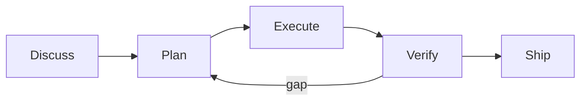
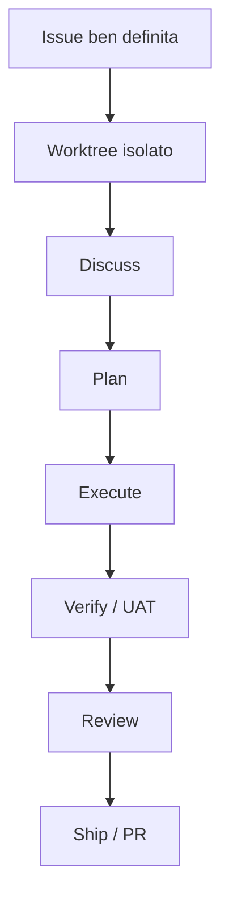

# GSD Core — schema pratico

> Stato della ricerca: 6 settembre 2026  
> Obiettivo: capire il **metodo mentale** di GSD in meno di un'ora e decidere cosa vale la pena portare nel workflow Stealth.

## In una frase

**GSD (Git. Ship. Done.) è un sistema di context engineering + spec-driven development che fa lavorare l'agente per fasi, con stato persistente fuori dalla chat e subagent a contesto fresco.**

Non è soprattutto un task manager e non è un daemon tipo Symphony. È più vicino a una disciplina operativa per portare un pezzo di lavoro da idea a PR verificata.



Il valore non è nei nomi dei cinque step. È nel fatto che **discussione, piano, esecuzione e verifica non vivono tutte nella stessa conversazione indistinta**.

---

## Come funziona davvero

### 1. Discuss

Prima di costruire, GSD cattura le decisioni che cambiano davvero il risultato.

L'obiettivo non è scrivere una specifica enorme: è evitare che l'esecutore inventi una business rule o una decisione architetturale mentre sta già modificando codice.

Output tipico: `CONTEXT.md` / decisioni della fase.

### 2. Plan

La fase viene scomposta in un piano eseguibile abbastanza piccolo da stare bene dentro un contesto fresco.

L'agente può fare ricerca sul repository, identificare dipendenze, ordinare task e definire le prove da ottenere.

Output tipico: `PLAN.md`.

### 3. Execute

Lavoro pesante in **subagent a contesto fresco**. È una risposta molto concreta al problema del context rot: invece di trascinare una sessione enorme, il sistema persiste lo stato utile in artefatti e ricrea contesti puliti per l'esecuzione.

GSD può eseguire piani in parallelo e dispone di manager/autonomous mode per coordinare più lavoro.

### 4. Verify

La feature non è chiusa perché il codice compila o perché l'agente dice "done".

`/gsd-verify-work` produce un `UAT.md`: acceptance criteria, prove, gap emersi. Se la verifica trova un buco, questo rientra nel piano con un fix loop invece di essere trasformato in una giustificazione testuale.

### 5. Ship

Review, PR e decisione umana finale. Il modello può fare molto, ma GSD mantiene espliciti i gate di verifica/review/ship.

---

## La parte più utile per noi: issue-driven orchestration

GSD oggi documenta un workflow stabile per partire da una issue GitHub/Linear/Jira:



La mappatura ufficiale è interessante perché mostra che GSD ha già molti mattoni che assomigliano a Symphony:

| Esigenza | GSD |
|---|---|
| workspace isolato | `/gsd-workspace --new --strategy worktree` |
| stato persistente | `STATE.md`, `CONTEXT.md`, `PLAN.md` |
| orchestrazione | `/gsd-manager`, `/gsd-autonomous` |
| specifica | discuss + plan |
| proof of work | `/gsd-verify-work` → `UAT.md` |
| review | `/gsd-review` |
| PR / ship | `/gsd-ship` |

**Limite importante:** questa integrazione col tracker è oggi una *recipe*, non un bridge nativo. GSD non crea/commenta/chiude automaticamente issue remote e non gira come poller sempre attivo.

Questo è il motivo per cui, per la UX desiderata da Mauro — *"io dico fammi X e il sistema crea/reusa la issue corretta"* — serve ancora un intake sottile oppure uno strumento sopra GSD.

---

## Cosa imparerei anche se non adottassimo GSD

1. **La chat non deve essere la memoria del progetto.** Stato e decisioni importanti vanno in artefatti durevoli.
2. **Il contesto fresco è una feature.** Un esecutore pulito che riceve un contratto buono è spesso migliore di una sessione da 150 messaggi.
3. **Specifica proporzionale, non assente.** Prima decidere ciò che cambia il prodotto; il resto può essere scoperto nel codice.
4. **Verification è una fase indipendente.** Non coincide con "ho eseguito dei test".
5. **Una fase deve essere dimensionata per convergere.** Se non entra bene in un contesto, va scomposta.
6. **Human attention è un gate, non il motore.** L'umano decide dove serve giudizio; non accompagna ogni tool call.

---

## Cosa NON copierei alla lettera in Stealth

- Non trasformerei `.planning/` in un secondo database di task se decidiamo che **GitHub Issue è la task identity canonica**.
- Non imporrei cinque step visibili per una modifica banale.
- Non farei imparare a Mauro una ventina di `/gsd-*` per il lavoro quotidiano: il router deve essere invisibile.
- Non userei GSD come giustificazione per evitare verifier specifici del progetto. `UAT.md` è utile, ma il risultato reale va provato con PHP/DB/browser/PDF/email quando applicabile.
- Non introdurrei GSD + Trailhead + Gentle AI insieme. Uno deve possedere il workflow.

---

## Prova pratica in 45–60 minuti

Non partire da Assitec. Usa prima una repo disposable o una branch isolata.

### Setup

```bash
npx @opengsd/gsd-core@latest
```

Scegli **Codex** come runtime e poi, dentro una repo esistente:

```text
/gsd-onboard
```

### Esercizio

Prendi una richiesta piccola ma non banale, per esempio:

> Aggiungi un campo persistente e mostralo in una seconda vista.

Poi percorri una sola volta:

```text
/gsd-discuss-phase
/gsd-plan-phase
/gsd-execute-phase
/gsd-verify-work
/gsd-review
/gsd-ship
```

Durante il test non giudicare "quanto codice ha scritto". Guarda invece:

- cosa ha chiesto a te e cosa ha dedotto dal repo;
- se `CONTEXT.md` contiene solo decisioni utili o burocrazia;
- se il piano è realmente eseguibile;
- se l'esecutore devia dal piano;
- cosa finisce in `UAT.md`;
- se un gap di verifica torna davvero nel fix loop;
- quanto lavoro manuale richiede arrivare alla PR.

### Test didattico migliore

Dopo la prima esecuzione modifica intenzionalmente qualcosa che invalida una prova e riesegui verify. Il concetto da capire è: **la prova deve seguire lo stato reale del codice, non la memoria dell'agente**.

---

## Valutazione per Stealth

**Come scuola/metodo: 9/10.**  
**Come control plane definitivo per Stealth: 7/10.**

GSD è probabilmente il sistema che vale di più studiare per imparare una disciplina trasferibile. Anche se fra sei mesi usassimo Trailhead, Symphony o altro, resterebbero validi context engineering, fresh execution, phase sizing e verification indipendente.

La mia posizione oggi:

```text
STUDIARE GSD      → sì
INSTALLARLO OVUNQUE → no
COPIARNE I PRINCIPI → sì
FARE DI GSD IL NUOVO ADS → solo dopo un pilot reale
```

## Fonti

- GSD Core: https://github.com/open-gsd/gsd-core
- README corrente: https://github.com/open-gsd/gsd-core/blob/next/README.md
- Issue-driven orchestration (stable guide): https://github.com/open-gsd/gsd-core/blob/next/docs/issue-driven-orchestration.md
