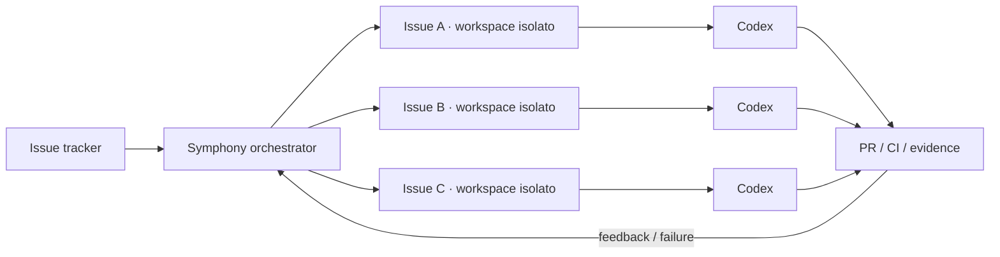
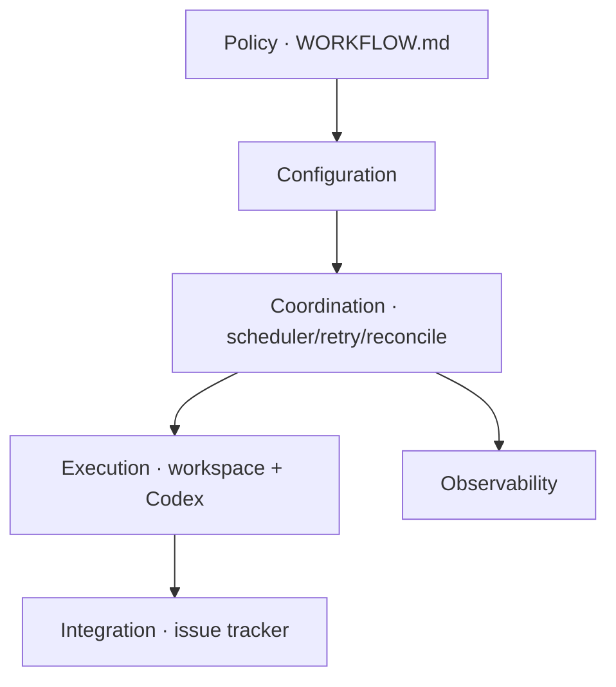

# OpenAI Symphony — schema pratico

> Stato della ricerca: 6 settembre 2026  
> Obiettivo: capire Symphony come **modello mentale e architettura**, non come prodotto da installare domani.

## In una frase

**Symphony sposta il centro del lavoro dalla sessione dell'agente alla issue.**

Non devi più pensare: "apro tre Codex e li seguo". Pensi: "questi sono i lavori aperti"; il sistema garantisce che ogni lavoro eleggibile abbia un agente attivo nel proprio workspace finché raggiunge lo stato di handoff previsto.



La frase chiave è:

> **Manage work, not agent sessions.**

---

## Perché OpenAI l'ha costruito

Prima Symphony, il team gestiva più sessioni Codex interattive. OpenAI racconta che la maggior parte degli ingegneri reggeva circa **3–5 sessioni contemporanee** prima che il context switching diventasse il vero collo di bottiglia.

Dopo aver reso il repository molto agent-friendly con harness engineering, il limite non era più principalmente "Codex sa programmare?". Era: **quanto tempo umano serve per avviare, controllare, riprendere e shepherdare tutte le sessioni?**

Symphony cambia unità di gestione:

```text
prima
SESSIONE → PR

poi
TICKET / DELIVERABLE → agenti, sessioni e PR sono dettagli di esecuzione
```

OpenAI riporta che questo approccio ha portato fino a un **+500% di PR integrate in alcuni team**. È un dato interno, non una promessa generalizzabile.

---

## La specifica pubblica

Symphony pubblico è prima di tutto un `SPEC.md` language-agnostic più una reference implementation Elixir.

OpenAI lo definisce un engineering preview e dice esplicitamente di **non volerlo mantenere come prodotto standalone**: va letto come reference architecture da adattare.

Il servizio:

1. legge continuamente lavoro da un issue tracker;
2. decide quali issue sono eleggibili;
3. crea un workspace deterministico e isolato per ciascuna issue;
4. lancia un coding agent in quel workspace;
5. osserva stato, crash, retry e cambi del tracker;
6. interrompe/rilancia/riconcilia quando necessario;
7. lascia al workflow della repo la logica concreta di implementazione, verifica e handoff.

### I layer



#### 1. Policy layer

`WORKFLOW.md` vive nel repository e contiene il contratto operativo: prompt, criteri, regole, handoff, comandi di verifica.

Quindi il comportamento dell'agente è **versionato assieme al codice**, non nascosto in una dashboard proprietaria.

#### 2. Coordination layer

Il vero Symphony: polling, eligibility, concorrenza, retry con backoff, stop dei task non più validi, riconciliazione.

#### 3. Execution layer

Workspace separato per issue + coding-agent process. Una sessione può morire: il deliverable continua a esistere perché l'identità è il ticket, non la chat.

#### 4. Tracker

Il tracker è il control plane. La specifica pubblica è genericamente adapter-based; l'esempio OpenAI nasce su Linear.

#### 5. Observability

Almeno log strutturati, eventualmente dashboard/status surface. L'operatore deve vedere **cosa sta lavorando**, non entrare in ogni sessione.

---

## La lezione più importante: non costruire una state machine troppo rigida

Una delle evoluzioni raccontate da OpenAI è particolarmente importante per ADS.

Le prime versioni cercavano di guidare gli agenti attraverso transizioni strette. Col tempo il team ha preferito dare:

```text
OBJECTIVE
+ TOOLS
+ CONTEXT
+ GUARDRAILS
```

piuttosto che imporre ogni micro-step.

Il modello sa ragionare; il sistema deve rendere **leggibili ed enforceable** obiettivo, limiti e feedback loop.

Per Stealth significa: attenzione a non costruire di nuovo

```text
INTAKE → UNDERSTAND → CONTRACT → PLAN → PRE-FLIGHT → EXECUTE → ...
```

come workflow engine proprietario obbligatorio. Possiamo conservare i principi senza programmare una macchina a 10 stati.

---

## Symphony dipende dall'harness della repo

Symphony non rende magicamente autonoma una codebase opaca.

OpenAI dice che funziona meglio su codebase preparate con **harness engineering**:

```text
repository knowledge
+ strumenti
+ test
+ guardrail
+ skills
+ runtime observability
```

Il post precedente di OpenAI sull'harness engineering è quasi più importante del daemon stesso. Lì la regola è:

> quando l'agente fallisce, non chiedergli soltanto di "provare meglio": chiediti quale capacità, informazione o controllo manca nell'ambiente e rendilo disponibile/enforceable.

Questa è esattamente la lezione emersa anche da DVNS.

---

## GSD vs Symphony

Non sono veri concorrenti: vivono a livelli diversi.

| | GSD | Symphony |
|---|---|---|
| Domanda principale | Come porto bene **questo lavoro** a termine? | Come tengo **tutti i lavori** continuamente serviti da agenti? |
| Unità | fase / feature | issue / deliverable |
| Stato | artefatti di planning | tracker + orchestrator |
| Sessioni | subagent freschi | processi disposable per issue |
| Sempre attivo | no | sì |
| Polling tracker | no | sì |
| Verification | parte centrale del metodo | definita dal workflow/harness |
| Obiettivo | disciplina di esecuzione | autonomia operativa / throughput |

Una possibile evoluzione futura è quindi:

```text
GitHub Issues
    ↓
Symphony-like scheduler
    ↓
per issue: metodo GSD-like / repo-native
    ↓
project verifier
    ↓
PR / CI
```

Ma non serve costruirla oggi.

---

## Cosa imparerei per Stealth

1. **GitHub Issue come durable task identity.** Sessioni, branch e PR possono cambiare; il lavoro resta.
2. **Workspace per issue.** Ottimo quando inizieremo a far girare più lavori contemporaneamente.
3. **Retry/reconciliation sono infrastruttura, non prompt.** Se un agente crasha o CI fallisce, il sistema deve poter riprendere.
4. **Policy in repo.** `AGENTS.md`, `PROJECT.md`, verifier e workflow devono viaggiare col progetto.
5. **Proof of work.** Un task deve tornare con CI, review, test, video/screenshot o altra evidenza appropriata.
6. **Human attention sulle eccezioni.** Non supervisionare tutti i tool call.
7. **Obiettivi > micro-orchestrazione.** Più capacità ha il modello, più il sistema deve definire contratti e strumenti, non scrivere un copione minuzioso.

---

## Cosa NON farei adesso

Non costruirei un `stealth-symphony`.

Oggi abbiamo ancora più valore da ottenere da:

```text
GitHub issue first
+ Codex
+ repo agent-ready
+ verifier vero
+ worktree quando serve
```

Il daemon sempre attivo diventa utile quando il problema reale è:

> "Ho una coda di 10–30 lavori pronti e sto perdendo tempo ad avviare/riprendere agenti."

Non quando il problema è ancora:

> "Il singolo agente capisce bene il nostro legacy e verifica davvero ciò che ha fatto?"

---

## Esercizio di studio in 30 minuti

Non serve installarlo.

### 1. Leggi il README e le prime sezioni di `SPEC.md`

Concentrati su:

- problem statement;
- goals / non-goals;
- main components;
- abstraction layers.

### 2. Disegna il tuo Stealth Symphony su carta

```text
TRACKER      GitHub Issues
WORKSPACE    Mac git worktree
AGENT        Codex
POLICY       AGENTS.md + PROJECT.md
VERIFY       dev/verify-local.sh + browser/DB
HANDOFF      PR ready for review
DEPLOY       manuale / ADS deploy
```

Se la mappa è comprensibile in 10 righe, hai capito Symphony. Se richiede un enorme orchestrator custom, stai già aggiungendo complessità che la specifica cerca di evitare.

### 3. Simula Symphony manualmente

Prendi due issue indipendenti, crea due worktree e lancia due Codex. Non cercare automazione: osserva quali informazioni e verifier mancano affinché tu possa **non guardare le sessioni** e giudicare solo i risultati.

Quella lista di mancanze è molto più preziosa di costruire subito il daemon.

---

## Valutazione per Stealth

**Come modello mentale: 10/10.**  
**Come software da adottare oggi: 5/10.**

Symphony ci dice probabilmente dove andrà ADS nel lungo periodo, ma non ci dice che dobbiamo costruirlo adesso.

La parte da portare subito è:

```text
manage work, not sessions
+ repo as operating contract
+ isolated execution
+ evidence
+ human-by-exception
```

## Fonti

- OpenAI Symphony repo: https://github.com/openai/symphony
- Symphony specification: https://github.com/openai/symphony/blob/main/SPEC.md
- OpenAI, “An open-source spec for Codex orchestration: Symphony” (27 Apr 2026): https://openai.com/index/open-source-codex-orchestration-symphony/
- OpenAI, “Harness engineering: leveraging Codex in an agent-first world” (11 Feb 2026): https://openai.com/index/harness-engineering/
